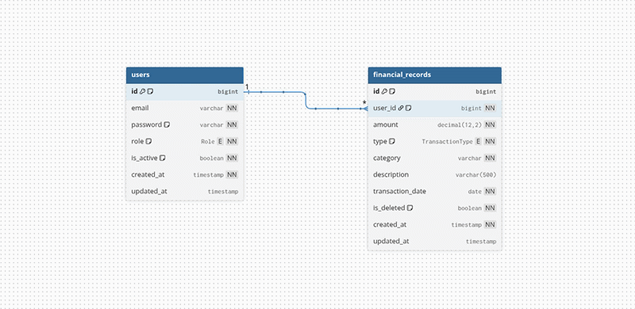
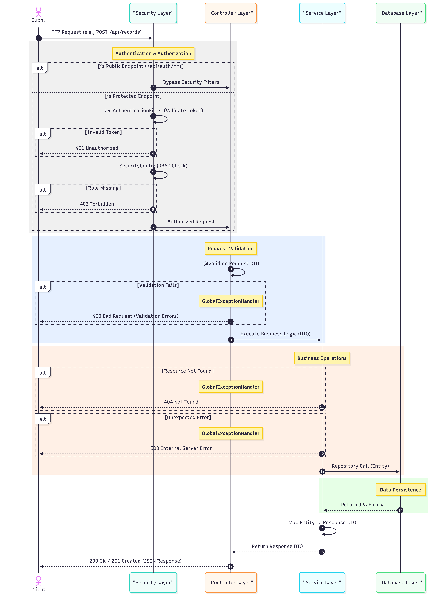

# Finance Data Processing and Access Control Backend

## 1. Project Overview & Tech Stack

### Executive Summary
A robust, enterprise-grade Spring Boot backend designed for secure management of financial records and real-time dashboard analytics. The system implements granular Role-Based Access Control (RBAC) to ensure data integrity and confidentiality across different user tiers.

> ### 🌐 **Live API Documentation**
> **[Access Swagger UI](https://fiscus-backend.onrender.com/swagger-ui/index.html)**
>
> ⚠️ **Note:** Since this is hosted on a free tier, the initial response may take **50-60 seconds** to load if the service is in a "cold start" state.

### Technology Matrix
| Component | Technology | Rationale |
| :--- | :--- | :--- |
| **Backend Framework** | Spring Boot 4.0.5 | Leverage latest ecosystem features, high productivity, and mature dependency injection. |
| **Language** | Java 21 | Utilize modern Java features like Records, Pattern Matching, and Virtual Threads for scalability. |
| **Database** | MySQL | Reliable relational storage for transactional integrity and complex aggregation queries. |
| **Security** | JWT (JSON Web Token) | Stateless authentication suitable for modern web and mobile clients. |
| **Documentation** | SpringDoc OpenAPI 3 | Automated, interactive API documentation and testing interface. |
| **Data Access** | Spring Data JPA (Hibernate) | Simplifies database operations with high-level abstractions and repository patterns. |

---

## 2. Architecture & Design Decisions

### Pattern
The project follows a **Layered Architecture** pattern, ensuring clear separation of concerns:
- **Controller Layer:** Handles HTTP requests, input validation, and maps data to/from DTOs.
- **Service Layer:** Orchestrates business logic, transaction management, and security enforcement.
- **Repository Layer:** Abstracts data access logic using Spring Data JPA and custom JPQL for aggregations.
- **DTO Layer:** Decouples internal entities from external API contracts to prevent data leakage.

### Data Modeling
The system centers around two primary entities:
- **User:** Manages identity, authentication credentials (BCrypt hashed), and authorization roles.
- **FinancialRecord:** Captures transaction details including amount, type (Income/Expense), category, and a many-to-one relationship with the User who created it.



---

## 3. Role-Based Access Control (RBAC)

### Access Matrix
| Resource | Admin | Analyst | Viewer |
| :--- | :---: | :---: | :---: |
| **User Management** (CRUD) | Full Access | No Access | No Access |
| **Financial Records** (Create/Update/Delete) | Full Access | No Access | No Access |
| **Financial Records** (Read/Filter) | Full Access | Full Access | No Access |
| **Dashboard Summary** (Analytics) | Full Access | Full Access | Full Access |

### Enforcement
Authorization is strictly enforced at the **Security Filter Chain** level. The `SecurityConfig` utilizes `requestMatchers` with `hasRole()` and `hasAnyRole()` constraints. Before any sensitive service logic is executed, the `JwtAuthenticationFilter` validates the bearer token and populates the `SecurityContext`, ensuring that users can only hit endpoints they are explicitly authorized for.

---

## 4. API Reference & Analytics Logic

### Base Configuration
- **Base URL:** `http://localhost:8080`
- **Auth Requirement:** Bearer Token (JWT) required for all endpoints except `/api/auth/**`.

### Grouped Endpoints

#### Authentication
| Method | Endpoint | Description |
| :--- | :--- | :--- |
| POST | `/api/auth/login` | Authenticate and receive JWT. |

#### Financial Records
| Method | Endpoint | Access | Description |
| :--- | :--- | :--- | :--- |
| GET | `/api/records` | Admin, Analyst | Filtered, paginated list of transactions. |
| POST | `/api/records` | Admin | Create a new financial entry. |
| PUT | `/api/records/{id}` | Admin | Update transaction details. |
| DELETE | `/api/records/{id}` | Admin | Permanently remove a record. |

#### Dashboard & Analytics
| Method | Endpoint | Access | Description |
| :--- | :--- | :--- | :--- |
| GET | `/api/dashboard/summary` | All Roles | High-level financial aggregates. |

### Analytics Implementation
Financial aggregations are computed using optimized **SQL Aggregation Functions** (SUM, COUNT, GROUP BY) at the database level to ensure maximum performance and accuracy:
- **Net Balance:** Computed as `SUM(Income) - SUM(Expenses)`.
- **Category Totals:** Derived via `GROUP BY category` queries to provide a breakdown of spending/earning patterns.
- **Time-based Trends:** Current month aggregates are filtered using `transactionDate` ranges (Start of Month to End of Month).



---

## 5. Technical Assumptions & Trade-offs

- **Currency Precision:** Monetary values are handled using `BigDecimal` with 2-decimal precision to prevent floating-point rounding errors common with `double`.
- **Soft Deletes:** The system implements a robust soft-delete mechanism for financial records using Hibernate's `@SQLDelete` and `@SQLRestriction` annotations, ensuring data can be audited or recovered if necessary.
- **Single Currency:** The system assumes a single base currency (e.g., USD or INR); multi-currency conversion logic is currently out of scope.
- **JWT Lifespan:** Tokens are issued with a fixed expiration; refresh token rotation is identified as a future enhancement.

---

## 6. Validation & Error Resilience

### Input Validation
The system utilizes **JSR-303/JSR-380 Bean Validation** (e.g., `@NotNull`, `@Positive`, `@Size`) on all Request DTOs. This ensures that only well-formed data reaches the service layer.

### Error Responses
All exceptions are intercepted by a `GlobalExceptionHandler` to provide standardized JSON responses:
```json
{
  "timestamp": "2026-04-06T12:00:00",
  "status": 400,
  "error": "Validation Failed",
  "message": "One or more fields are invalid",
  "path": "/api/records",
  "validationErrors": {
    "amount": "must be greater than 0"
  }
}
```

---

## 7. Installation & Setup

### Prerequisites
- **Java 21 JDK**
- **Maven 3.9+**
- **MySQL 8.0+**

### Deployment
1. **Clone the repository:**
   ```bash
   git clone <repository-url>
   cd fiscus-backend
   ```
2. **Configure Environment:**
   Update `src/main/resources/application.properties` with your database credentials.
3. **Build and Run:**
   ```bash
   ./mvnw clean install
   ./mvnw spring-boot:run
   ```
4. **Access Swagger UI:**
   Navigate to `http://localhost:8080/swagger-ui.html` to explore and test the APIs.

### Verification
Run the automated test suite to verify the installation:
```bash
./mvnw test
```

---

## 8. Roadmap / Future Enhancements
- **Audit Logging:** Implement AOP-based logging to track Admin actions and sensitive record modifications.
- **Multi-Currency Support:** Add dynamic currency conversion using external FX rate APIs.
- **Pagination in Dashboard:** Support for paginated "Recent Transactions" in the dashboard summary.
- **Advanced Search:** Integration with ElasticSearch or specialized indexing for complex transaction searches.
